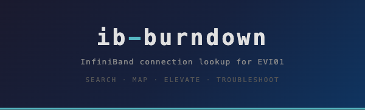
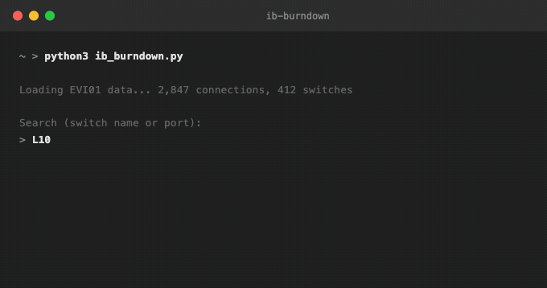
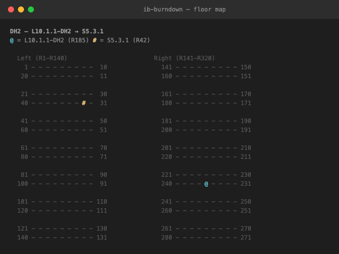
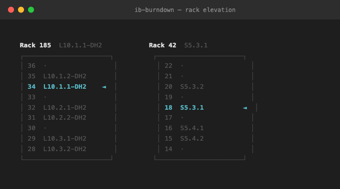
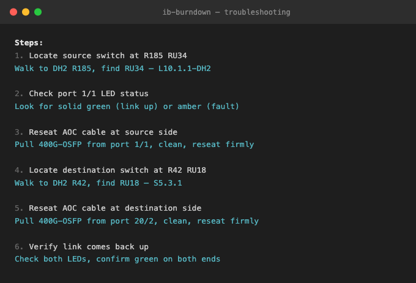

<div align="center">
  
  <br><br>
  <b>Search any IB switch at EVI01 from your terminal.</b>
  <br>
  Type a name, get the port, cable, rack, and floor map.
  <br><br>
  <a href="LICENSE"></a>
</div>

<br>

## Get started

**3 steps. That's it.**

```bash
git clone https://github.com/rpatino-cw/ib-burndown.git && cd ib-burndown && pip3 install -e .
```

Download the [IB Sketch](https://docs.google.com/spreadsheets/d/1U132alRVDtcrVd5kW4v534U3ME7wRZ5g3kHQMZP2LaM/edit?gid=1992819001#gid=1992819001) (File > Download > .xlsx) and drop it in the folder.

```bash
ib-lookup
```

> Also works with `python3 ib_burndown.py` if you skip the install.

<br>

## Search



<br>

## Floor map — `m`



<br>

## Rack elevation — `e`



<br>

## Troubleshooting — `t`



<br>

---

Fork, PR, no xlsx files (internal data). [MIT](LICENSE)
